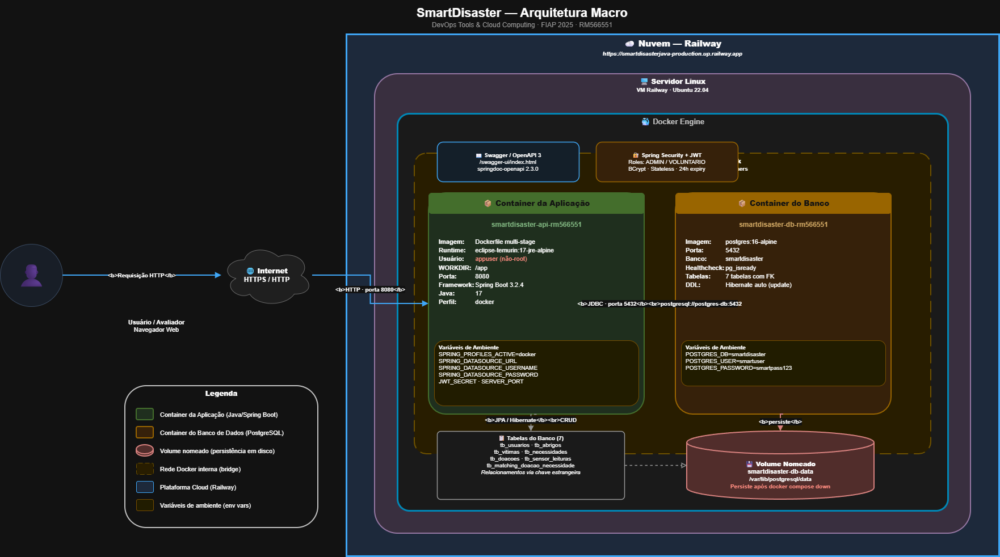
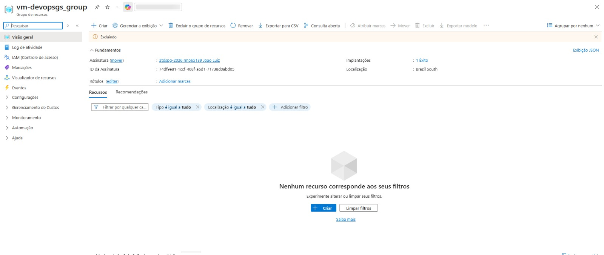

# SmartDisaster — DevOps Tools & Cloud Computing

> Plataforma REST de gestão inteligente de emergências e desastres, containerizada com Docker e implantada em nuvem.

---

## Equipe

| Nome Completo | RM |
|---|---|
| Pedro Vaz Ferreira | RM566551 |
| João Victor Luiz Oliveira Resende | RM565139 |

**Disciplina:** DevOps Tools & Cloud Computing — FIAP Global Solution 2025

---

## Links

| Recurso | Endereço |
|---|---|
| **Vídeo Pitch** | https://youtu.be/ItPEbWxzNkw |
| **Vídeo Demonstração DevOps** | ... |

---

## Descrição da Solução

Em situações de desastre natural, a ausência de um sistema centralizado de informação resulta em má distribuição de recursos, superlotação de abrigos e vítimas sem atendimento. O **SmartDisaster** é uma API REST que resolve esse problema centralizando a gestão logística de emergências em uma única plataforma.

A solução gerencia:

- **Abrigos** — capacidade, localização e status operacional (ativo / lotado / inativo)
- **Vítimas** — cadastro e vínculo com abrigos, com registro de condição de saúde
- **Voluntários** — controle de colaboradores habilitados a registrar doações
- **Doações** — rastreamento de recursos do registro até a entrega
- **Necessidades** — demandas de cada abrigo por tipo e quantidade de recurso
- **Sensores IoT** — leituras de ocupação e temperatura com atualização automática de status
- **Engine de Matching** — cruzamento automático entre doações disponíveis e necessidades pendentes

A aplicação é desenvolvida em **Java 17 com Spring Boot 3.2.4**, containerizada via **Docker**, e implantada em nuvem utilizando **Railway**.

---

## Arquitetura Macro



| Componente | Descrição |
|---|---|
| **Container API** | Imagem personalizada via Dockerfile multi-stage. Executa como `appuser` (não-root). WORKDIR `/app`. Porta `8080`. Perfil `docker` ativado por variável de ambiente. |
| **Container Banco** | Imagem pública `postgres:16-alpine`. Porta `5432`. Credenciais via variáveis de ambiente. |
| **Rede Docker** | `smartdisaster-network` — bridge dedicada que conecta os dois containers. Resolução DNS interna pelo nome do service. |
| **Volume nomeado** | `smartdisaster-db-data` — os dados persistem mesmo após `docker compose down`. |

---

## Tecnologias

| Tecnologia | Versão | Papel |
|---|---|---|
| Java | 17 | Linguagem principal |
| Spring Boot | 3.2.4 | Framework da API |
| Spring Data JPA | 3.x | ORM e acesso ao banco |
| Spring Security + JWT | 6.x | Autenticação stateless |
| Spring HATEOAS | 2.x | Hipermídia nos responses |
| PostgreSQL | 16 | Banco de dados relacional |
| Docker | — | Containerização |
| Docker Compose | — | Orquestração dos containers |
| Maven | 3.9.6 | Build e dependências |
| springdoc-openapi | 2.3.0 | Documentação Swagger |

---

## Infraestrutura Docker

### Container da Aplicação — `smartdisaster-api-rm566551`

| Item | Valor |
|---|---|
| Imagem | Gerada via `Dockerfile` multi-stage (Maven builder + JRE Alpine runtime) |
| Usuário | `appuser` (não-root) |
| WORKDIR | `/app` |
| Porta exposta | `8080` |
| Variáveis de ambiente | `SPRING_PROFILES_ACTIVE`, `SPRING_DATASOURCE_URL`, `SPRING_DATASOURCE_USERNAME`, `SPRING_DATASOURCE_PASSWORD`, `JWT_SECRET`, `SERVER_PORT` |
| Rede | `smartdisaster-network` |

### Container do Banco — `smartdisaster-db-rm566551`

| Item | Valor |
|---|---|
| Imagem | `postgres:16-alpine` (pública) |
| Porta exposta | `5432` |
| Volume nomeado | `smartdisaster-db-data` |
| Variáveis de ambiente | `POSTGRES_DB`, `POSTGRES_USER`, `POSTGRES_PASSWORD` |
| Rede | `smartdisaster-network` |
| Healthcheck | `pg_isready -U smartuser -d smartdisaster` |

### Banco de Dados — Tabelas e Relacionamentos

O banco possui **7 tabelas** com relacionamentos via chave estrangeira:

| Tabela | Relacionamentos |
|---|---|
| `tb_usuarios` | — (base para Admin e Voluntário via SINGLE_TABLE) |
| `tb_abrigos` | ← `tb_vitimas`, `tb_necessidades`, `tb_doacoes`, `tb_sensor_leituras` |
| `tb_vitimas` | → `tb_abrigos` (FK `abrigo_id`) |
| `tb_necessidades` | → `tb_abrigos` (FK `abrigo_id`) |
| `tb_doacoes` | → `tb_abrigos`, `tb_necessidades`, `tb_usuarios` |
| `tb_sensor_leituras` | → `tb_abrigos` (FK `abrigo_id`) |
| `tb_matching_doacao_necessidade` | → `tb_doacoes`, `tb_necessidades` (chave composta) |

---

## How to — Tutorial Completo

> **Pré-requisito:** Docker e Docker Compose instalados na máquina.

---

### Passo 1 — Clonar o repositório

```bash
git clone https://github.com/SmartDisaster/SmartDisaster__Cloud.git
cd smartdisaster
```

---

### Passo 2 — Construir e iniciar os containers em segundo plano

```bash
docker compose up -d --build
```

O processo executa um build multi-stage:
- **Stage 1** `maven:3.9.6-eclipse-temurin-17` — compila o projeto e gera o JAR
- **Stage 2** `eclipse-temurin:17-jre-alpine` — executa o JAR como `appuser`

O container da API aguarda o healthcheck do PostgreSQL (`healthy`) antes de iniciar.

---

### Passo 3 — Verificar containers em execução

```bash
docker ps
```

Saída esperada:

```
NAMES                        IMAGE                         STATUS                   PORTS
smartdisaster-api-rm566551   api_smart-smartdisaster-api   Up X minutes             0.0.0.0:8080->8080/tcp
smartdisaster-db-rm566551    postgres:16-alpine            Up X minutes (healthy)   0.0.0.0:5432->5432/tcp
```

---

### Passo 4 — Exibir logs do container da aplicação

```bash
docker logs smartdisaster-api-rm566551
```

Saída esperada ao final:

```
INFO : The following 1 profile is active: "docker"
INFO : HikariPool-1 - Start completed.
INFO : Tomcat started on port 8080 (http)
INFO : Started SmartDisasterApplication in X seconds
INFO : Seed concluído: 1 admin, 2 voluntários, 6 abrigos, 3 vítimas, 9 necessidades, 4 doações
```

---

### Passo 5 — Exibir logs do container do banco

```bash
docker logs smartdisaster-db-rm566551
```

Saída esperada:

```
LOG: database system is ready to accept connections
```

---

### Passo 6 — Acessar o container da aplicação e inspecionar

```bash
docker container exec -it smartdisaster-api-rm566551 sh
```

Dentro do container, execute:

```sh
whoami
```
> Resultado esperado: `appuser`

```sh
pwd
```
> Resultado esperado: `/app`

```sh
ls -l
```
> Resultado esperado:
> ```
> -rw-r--r--    1 appuser  appgroup  65100496 Jun  9 06:03 app.jar
> ```

```sh
exit
```

---

### Passo 7 — Acessar o container do banco e inspecionar

```bash
docker container exec -it smartdisaster-db-rm566551 bash
```

Dentro do container, execute:

```sh
whoami
```
> Resultado esperado: `root` (imagem pública padrão do PostgreSQL)

```sh
pwd
```

```sh
ls -l
```

```sh
exit
```

---

### Passo 8 — Conectar ao PostgreSQL e evidenciar persistência

```bash
docker container exec -it smartdisaster-db-rm566551 bash
```

Dentro do container:

```bash
psql -U smartuser -d smartdisaster
```

**Listar todas as tabelas:**

```sql
\dt
```

Resultado esperado:

```
 Schema |              Name              | Type  |   Owner
--------+--------------------------------+-------+-----------
 public | tb_abrigos                     | table | smartuser
 public | tb_doacoes                     | table | smartuser
 public | tb_matching_doacao_necessidade | table | smartuser
 public | tb_necessidades                | table | smartuser
 public | tb_sensor_leituras             | table | smartuser
 public | tb_usuarios                    | table | smartuser
 public | tb_vitimas                     | table | smartuser
(7 rows)
```

**Evidências de persistência por SELECT:**

```sql
SELECT id, nome, status, capacidade_maxima FROM tb_abrigos;
```

```sql
SELECT id, nome, cpf, data_nascimento FROM tb_vitimas;
```

```sql
SELECT id, tipo, quantidade, status FROM tb_doacoes;
```

```sql
SELECT id, tipo, quantidade_necessaria, status FROM tb_necessidades;
```

```sql
SELECT id, email, role FROM tb_usuarios;
```

```sql
-- Relacionamento: vítimas por abrigo
SELECT v.nome AS vitima, a.nome AS abrigo
FROM tb_vitimas v
JOIN tb_abrigos a ON v.abrigo_id = a.id;
```

```sql
-- Relacionamento: doações por abrigo e necessidade
SELECT d.tipo, d.quantidade, a.nome AS abrigo, n.tipo AS necessidade
FROM tb_doacoes d
JOIN tb_abrigos a ON d.abrigo_id = a.id
JOIN tb_necessidades n ON d.necessidade_id = n.id;
```

```sql
\q
exit
```

---

### Passo 9 — Acessar a documentação Swagger

Após confirmar que os containers estão com status `Up`, acesse a documentação interativa na porta `8080` do host onde o Docker está em execução:

```
http://<IP_DO_HOST>:8080/swagger-ui/index.html
```

> O mapeamento `0.0.0.0:8080->8080/tcp` exibido pelo `docker ps` indica que a porta está acessível na interface de rede do host.

**Alternativa — produção em nuvem (Railway):**

```
https://smartdisasterjava-production.up.railway.app/swagger-ui.html
```

---

### Passo 10 — Autenticar e testar o CRUD

**1. Obter token JWT**

`POST /auth/login` com as credenciais pré-cadastradas:

```json
{
  "email": "admin@smartdisaster.com",
  "senha": "123456"
}
```

**2. Autorizar no Swagger**

Clique em **Authorize**, cole o token no campo `bearerAuth` e clique em **Authorize**.

**3. Testar Create — POST /abrigos**

```json
{
  "nome": "Abrigo Avaliação FIAP",
  "capacidadeMaxima": 100,
  "latitude": -23.5489,
  "longitude": -46.6388,
  "status": "ATIVO",
  "endereco": {
    "rua": "Av. Paulista",
    "numero": "1000",
    "bairro": "Bela Vista",
    "cidade": "São Paulo",
    "estado": "SP",
    "cep": "01310-100"
  }
}
```

**4. Testar Read — GET /abrigos**

Confirme que o registro criado aparece na listagem.

**5. Testar Update — PUT /abrigos/{id}**

Altere o nome ou a capacidade do abrigo criado.

**6. Testar Delete — DELETE /abrigos/{id}**

Executa soft delete (status alterado para `INATIVO`).

**7. Confirmar persistência no banco após o CRUD**

```bash
docker container exec -it smartdisaster-db-rm566551 bash -c \
  "psql -U smartuser -d smartdisaster -c 'SELECT id, nome, status FROM tb_abrigos ORDER BY id;'"
```

---

### Passo 11 — Encerrar os containers

```bash
# Para e remove os containers (dados persistem no volume)
docker compose down

# Para, remove os containers E o volume (apaga dados)
docker compose down -v
```

---

## Evidência — VM Excluída na Nuvem

As imagens abaixo comprovam que a máquina virtual utilizada durante o desenvolvimento foi devidamente excluída ao final do projeto.



.jpeg)
